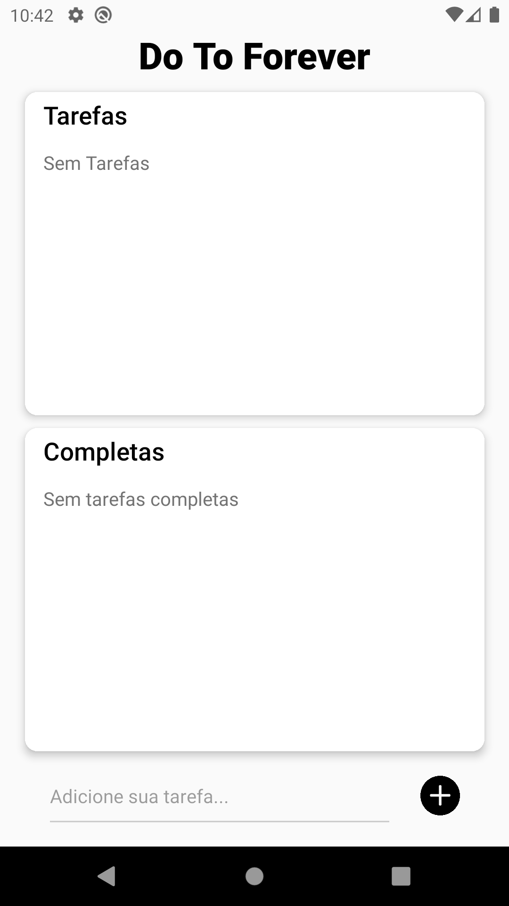
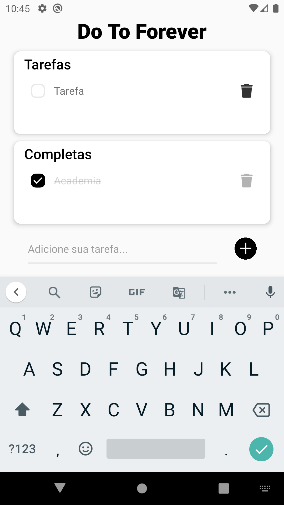
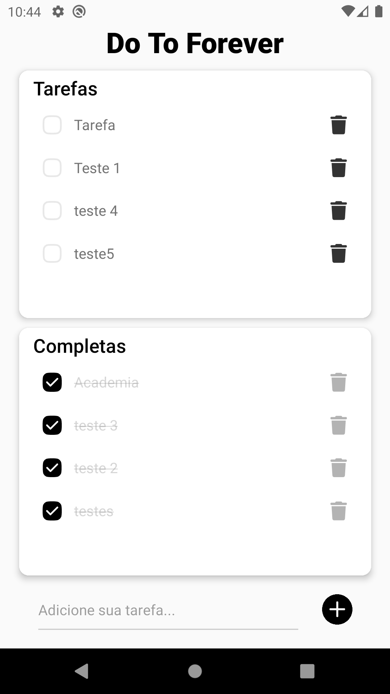

# To Do (React Native)

## Instalação do projeto

### Rodar o seguinte comando
```
npm install
```
## Telas do projeto

### Tela inicial


### Adicionar tarefa


### Tela com tarefas


## Link para download do APK no celular

Acesse o link abaixo em seu celular e na página de download terá um botão para instalar

- [Link APK](https://expo.dev/accounts/felipe.salomao/projects/todo-app-react-native/builds/dea2f659-1551-423f-9eb9-97c175ee2232)
